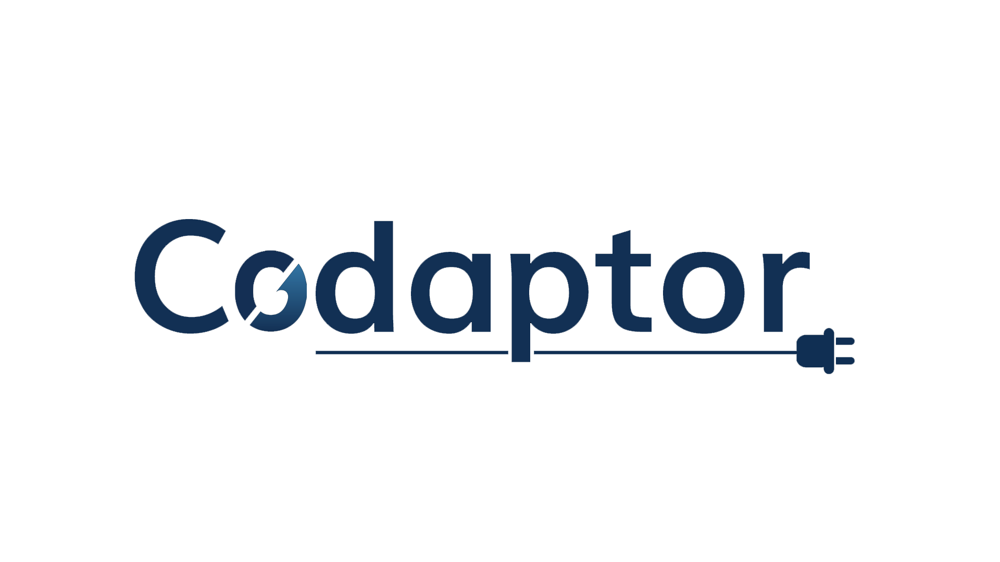

Codaptor is an open source project designed to address the needs of teams building decentralized applications
on [Corda](https://github.com/corda/corda) or integrating CorDapps with other systems. Corda is a great engine
for decentralized applications, but in order to communicate with a Corda node, teams have to develop bespoke
integrations using its Java client libraries. This comes with a steep learning curve, and adds complexity for
for teams working outside Java ecosystem, e.g. Node.js, .Net, or Python.

Codaptor solves this problem by automatically creating REST API for any CorDapp running on a Corda node. There are
many tools that understand REST APIs in every technology stack, and teams can pick and choose what works for them.
Codaptor also allows to decouple API users from the underlying Corda node in order to improve the availability,
reliability, and flexibility of the overall system.

## Features

* Zero-configuration deployment option as an embedded Corda service -- great for development and integration testing
* Generation of [OpenAPI 3](https://github.com/OAI/OpenAPI-Specification) JSON spec for the API endpoint based 
  on actual flows and contract state classes of available CorDapps
* Embedded [Swagger UI](https://swagger.io/tools/swagger-ui/) for exploring the API in your browser
* Docker-friendly standalone deployment option configurable via environment variables and compatible with
  Kubernetes secrets management
* Synchronous or asynchronous execution of Corda flows via the API
* Comprehensive API for node vault queries
* Flexible API security based on [PAC4J](https://www.pac4j.org/) allowing such authorization models as API keys,
  OpenID Connect, SAML 2, or just about anything else -- great for integrating managed services like AWS Cognito
* Full support for SSL out of the box
* Extensible architecture allowing bespoke features to be added as simply as dropping a JAR file into a directory

## Versions and artifacts

At the moment Codaptor is a pre-1.0 technology preview made available to the community to gather feedback and identify
areas for improvement. It is not considered production-ready yet.

Latest Codaptor release is [0.4.0](https://github.com/b180tech/cordaptor/releases/tag/v0.4.0). You can download
standalone bundle archive from the release page on GitHub. From version 0.4.0 cordaptor releases are tagged with the corda platform version they are built under. For ex, the current 0.4.0 version is tagged as `0.4.0-corda4.7`. All Codaptor modules are 
[available in Maven Central](https://search.maven.org/search?q=g:tech.b180.cordaptor%20AND%20v:0.4.0-corda4.7).
Embedded CorDapp bundle can be added using coordinates `tech.b180.cordaptor:cordaptor-bundle-rest-embedded:0.4.0-corda4.7` (
see [getting started guide](./docs/getting-started.md))

Branch [0.1.x](https://github.com/b180tech/cordaptor/tree/0.1.x) was created for bug fixes, and subsequent
releases of the 0.1.x are going to be bugfix only. Snapshot versions of all artifacts (`0.1-SNAPSHOT`)
are available from [Sonatype OSS Snapshots](https://oss.sonatype.org/content/repositories/snapshots/)
Maven repository if you do not want to wait for the release. Published snapshot versions pass all automated tests.

All new functionality is developed in `master` branch, and the next milestone release is going to be 0.5.0.
Snapshot versions of all artifacts (`0.4-SNAPSHOT`) are available from
[Sonatype OSS Snapshots](https://oss.sonatype.org/content/repositories/snapshots/)
Maven repository if you do not want to wait for the release. Published snapshot versions pass all automated tests.

## Getting started

Codaptor is designed from the ground up to be unobstructive, so there is **no code or configuration required**!
Simply download the embedded CorDapp bundle JAR file from the
[latest release page](https://github.com/b180tech/cordaptor/releases) and drop it into `cordapps` 
directory of your Corda node. Restart the node and fire up your browser to access the Swagger UI.

Read more in [Getting started](./docs/getting-started.md) guide about other ways to get immediately
productive with Codaptor.

## Next steps

* Learn how to [get started](./docs/getting-started.md) with Codaptor
* Learn more about [using](./docs/how-to-use.md) Codaptor
* Read about how Codaptor fits into your [architecture](./docs/architecture.md)
* Understand how to [configure](./docs/configuration.md) Codaptor
* Learn how to [create extensions](./docs/extensions.md) for Codaptor
* Stay tuned to updates in the [development blog](https://medium.com/b180tech)
* If you are developing for the Codaptor [developer guide](./docs/developer-guide.md)

## Getting support

We offer community support for Codaptor in `#cordaptor` channel on [Cordaledger Slack](https://slack.corda.net/).
The development team members can often be seen hanging out there.

If something isn't working, feel free to file a bug report through
[GitHub Issues](https://github.com/b180tech/cordaptor/issues). Although, we ask you to search for
related messages in the above Slack channel and among existing reported issues on GitHub first
to avoid creating duplicates.

For bespoke feature development, custom integrations and extensions, or commercial support enquiries, please email 
to [management@bond180.com](mailto:management@bond180.com?subject=Cordaptor).

## Contributing

Codaptor is an open-source project and contributions are welcome!

## License

[GNU Affero General Public License version 3 or later](./LICENSE)

SPDX:AGPL-3.0-or-later

Copyright (C) 2020 Bond180 Limited

**Important notice**: for the avoidance of doubt in the interpretation of the license terms,
the copyright holders commit to treat the following uses of Codaptor as 'aggregate' as opposed to 'modified versions':
1. Deploying embedded Codaptor bundle JAR file into a Corda node, regardless of whether it is a file
distributed as a binary or built from the source code, as long as the source code of all modules in the bundle
remains unmodified.
2. Annotating application code with annotation types provided by Codaptor in order to fine-tune the behaviour
of Codaptor components interacting with the application code.
3. Creating extensions for Codaptor using it's published microkernel's and modules' APIs, where the
extensions' code is assembled into separate JAR files and made available for Codaptor microkernel
to dynamically discover at runtime. For clarity's sake, code constituting published APIs must be appropriately
annotated, see [Extending Cordaptor](./docs/extensions.md) for further details.
4. Including Codaptor as a component of a broader application architecture where other components interact with it
using network communication protocols regardless of how Codaptor is deployed and configured.

The intent of using AGPL is to protect the interests of the Codaptor user community and ensure any bug fixes
and important new features developed by some users become available to everyone else. It is not the intent of
using AGPL to force disclose of any proprietary application code relying on Codaptor.
