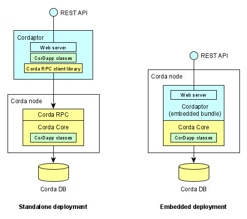

# Cordaptor in your architecture

This guide covers a number of topics related to the architecture of systems where Cordaptor (and Corda) are 
components of the whole. If you are interested in the architecture of Cordaptor itself, see
[Extensions](./extensions.md) instead.

* [Motivation for Cordaptor](#Motivation)
* [Deployment models](#Deployment)

## Motivation

Cordaptor is designed to make it easier to include Corda as a component of an overall architecture.

Corda is a great engine for decentralized applications. It shines in situations where a robust transaction-level
data privacy model is required, or where there is a strong imperative for making software friendly for enterprise use.
However, Corda forces a particular programming model upon the teams using it, which may become a considerable
barrier for adoption, and even necessitate looking for alternative, arguably less suitable, solutions.

Firstly, Corda requires all communications with node to go via Corda RPC, which is a proprietary binary
protocol tightly coupled with a Java client library. This forces teams adopting Corda to develop bespoke
integrations in Java, which comes with a steep learning curve, and adds complexity for teams working
outside Java ecosystem, using Node.js, .Net, Python, or other stacks.

Cordaptor solves this problem by automatically creating REST API for any CorDapp running on a Corda node
and generating [OpenAPI 3.0](https://github.com/OAI/OpenAPI-Specification) JSON specification for it.
There are many tools that understand REST APIs in every technology stack, and teams can pick
and choose what works for them.

Secondly, Corda by design is a system-of-record, and it isn't designed to face large number of queries
from the application front-end. This is problematic for applications having large user base,
as additional middle-tier components need to be created to shield the underlying node and provide a level
of caching. These components are inevitably highly bespoke and demanding in terms of development
and testing effort, but fundamentally are trivial and adding little value to the end user --
effectively a tax on development.

Cordaptor addresses this concern through introducing a highly configurable generic intermediary
layer offering a generic API for the front-end, whist also protecting the underlying Corda node.
In principle Cordaptor could be exposed directly to the front-end, unlike a naked Corda node,
which would nearly always require a middle-tier.

## Deployment

Cordaptor can be deployed in one of two ways, each of which has pros and cons. The following diagram
provides an overview of each deployment model, and subsequent sections elaborate on the details.

### Embedded CorDapp bundle

As part of any Cordaptor release, we make available an embedded bundle, which is effectively a CorDapp
intended to be deployed alongside existing CorDapp(s) into a Corda node. In this case,
Cordaptor will use Corda node mechanisms to dynamically discover what CorDapps are
running alongside it, and will create an API for them.

When running as embedded CorDapp inside a Corda node, Cordaptor is instantiated as a
[node service](https://docs.corda.net/docs/corda-os/4.6/node-services.html). It will use internal API
available to Corda services to initiate flows.

Adding Cordaptor embedded CorDapp bundle to a Corda node does not require changes to the node information
published on the network map, because the bundle does not provide any contract or state classes.

Benefits of using the embedded CorDapp bundle:
1. It is by far [the easiest way to get started](./getting-started.md) with Cordaptor requiring zero configuration.
2. It adds very little infrastructure to manage and monitor.
3. It operates inside a Corda node using internal APIs, which eliminates the need to set up any
RPC clients and manage their credentials.

Drawbacks of using the embedded CorDapp bundle:
1. Lifecycle of Cordaptor is linked to that of the Corda node, so when the node is down, so is Cordaptor.
2. It is impossible to scale out embedded Cordaptor to cope with the uptake in API use.
3. It shares compute and memory with the node, potentially requiring a larger server to run it on. This also 
makes it harder to accurately size necessary infrastructure.
4. It is impossible to introduce any additional security controls between Cordaptor and the node, as Corda services 
have complete access to the internals of the node.

### Standalone Cordaptor

Cordaptor also comes with a standalone distribution, either as a package, or via an official Docker image.

Unlike the embedded bundle, which is running inside a Corda node, standalone Cordaptor runs in a separate JVM
and establishes Corda RPC connection to the node. This requires Corda node to have RPC user accounts with
appropriate permissions. This allows to fine-tune and control the permissions granted to Cordaptor.

Benefits of using standalone Cordaptor:
1. Due to being a standalone JVM, Cordaptor can continue to serve its clients while the node is down,
which is useful for graceful node upgrades.
2. It is possible to launch multiple instances of Cordaptor to accommodate spikes in API usage, especially
when local caching is used to reduce the load on the underlying node
3. It runs in an independent JVM, which makes it easier to plan infrastructure use and accommodate growth
in transactions volume by putting it on a different container or host. 
4. It uses Corda RPC user credentials to access the node, which allows fine-grained security controls
to be implemented.

Drawbacks of using standalone Cordaptor:
1. Unlike zero-configuration embedded bundle, deploying Cordaptor standalone is more involved. In particular,
it requires Corda RPC user credentials to be configured and managed.
2. Standalone Cordaptor runs in a separate process, which needs to be monitored and managed accordingly. This also
adds another partial failure mode to the overall architecture to consider in the context of non-functional
requirements like availability and recoverability.

Note that as of preview version 0.1.x there is still limited support for Cordaptor working without
live connection to the underlying node.

### Selecting deployment model

We recommend using embedded CorDapp bundle for development and integration testing, and
using standalone Cordaptor in user testing and production.

There is an extensive compatibility test suite that makes sure Cordaptor works
the same way across embedded and standalone modes. However, there are some differences to keep in mind:
1. Corda security model requires flow classes to be annotated
   with `StartableByService` annotation for them to be available for initiation by a service, which
   is how embedded bundle is run. On the other hand, standalone Cordaptor uses Corda RPC to initiate
   flows, which requires flow classes to have `StartableByRPC` annotation. If you are planning to use
   both standalone and embedded models with the same CorDapp, then both annotations need to be present.
2. Standalone Cordaptor uses Corda RPC, which requires valid RPC client credentials with necessary
   permissions. This allows to fine-tune the security of the CorDapp. On the other hand, embedded
   Cordaptor is running as a Corda service effectively with administrative privileges on the node.
   
### Cordaptor in Docker

Standalone Cordaptor is fully compatible with Docker. Further, an official Docker image is provided
via Dockerhub: `b180tech/cordaptor:<version>`. The image is built from `openjdk:8u242` base image.
Refer to the [Dockerfile](../tar/Dockerfile) for details how it's built or require a different base image.
Consider contributing your Dockerfile by creating a pull request.

Cordaptor is compatible with standard practice of using environment variables to provide secrets to containers.
See [Secrets management](#Secrets management) below for further details.

## Functionality

Cordaptor exposes a web service offering a [REST API](https://en.wikipedia.org/wiki/Representational_state_transfer).
It follows all applicable implementation practices, such as the use of HTTP verbs and status codes,
use of content types, separation of resources by URL, and reliance on the underlying protocol
for client authentication.

Read more about Cordaptor API in the [usage guide](./how-to-use.md).

Note that Cordaptor API is modelled after the programming model of Corda itself,
and exposes such resources as contract states and flows. On the other hand, typical application API
is likely to be designed around key business domain entities represented by the application, such as accounts,
transactions, invoices, etc., and in this sense Cordaptor does not offer a true REST API for the application.

This was a conscious design decision. The truth is that creating a well-designed REST API requires
considerable level of awareness of the business domain, as well as overall system requirements,
which are impossible to infer from introspecting the CorDapps alone. Further, not everyone wants
to use REST per se on the outer edge, for example there are many benefits in using [GraphQL](https://graphql.org/).
Therefore, Cordaptor aims for pragmatism allowing systems architects to optimise for the overall
efficiency using suitable means.

In simple cases, Cordaptor API endpoints could be mapped to a REST API based on the application domain entities
using a simple API gateway or even an HTTP proxy. It would require GET queries to be mapped to
vault queries for respective contract state classes, and POST/PUT/DELETE queries to be mapped to
initiation calls for respective flows.

Another option available for application developers is to use Cordaptor as an application server and
deploy bespoke endpoints as extensions to Cordaptor. In this case, internal Cordaptor interfaces of
the underlying Corda node would be available to the developers, who would be able to write
application-specific code and expose application specific endpoints. Cordaptor features rich microkernel
supporting dependency injection, custom configuration with secrets management, JSON serialization framework,
and a simple REST framework, which makes it a plausible alternative to creating an independent
middle-tier service from scratch using something like Spring Boot.

Read more about developing extensions for Cordaptor in the [extensions guide](./extensions.md)

## Security

Cordaptor has a number of features that help to achieve secure-by-design overall architecture.

### Default configuration

Cordaptor comes with sensible settings built-in in order to minimise security risk
due to inadvertent deployment or in case of misconfiguration. In particular,
* Cordaptor by default listens for API calls on the loopback interface, which is normally inaccessible
from the network.
* Even though Cordaptor does not enable SSL by default, should it be enabled, it would use default Java SSLContext
settings when initializing SSL connection, which makes sure compromised protocols or cipher suites are disabled.

There are some handy tips on hardening Cordaptor for production in the [Configuration guide](./configuration.md).

### SSL

Cordaptor uses embedded Undertow as web server, which has out of the box support for SSL.
In default configuration Cordaptor does not use SSL, which is considered an acceptable trade off,
because by default it only accepts connections from localhost. However, SSL could be enabled
via the configuration file at any time. Read the [Configuration guide](./configuration.md) for details.

### API endpoint authentication

Cordaptor embeds [PAC4J](https://www.pac4j.org/) authentication and authorization library,
which supports wide variety of authentication protocols like OpenID connect, SAML 2, JWT tokens, API keys, etc.

### Secrets management

Cordaptor includes an extensible mechanism for managing secrets. Default implementation supports configuration files
and environment variables, which are suitable in many cases and compatible with secrets management practices
used in enterprises. Read the [Configuration guide](./configuration.md) for details.
